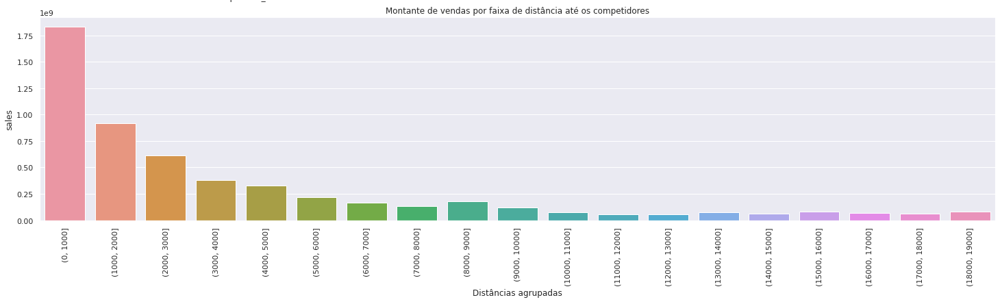
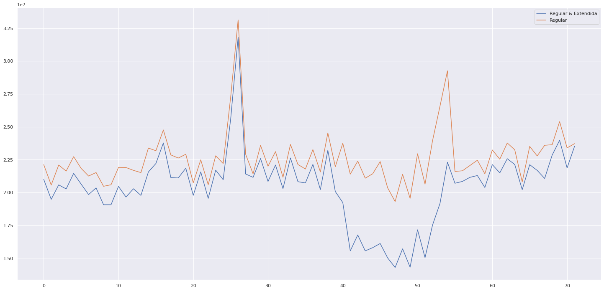
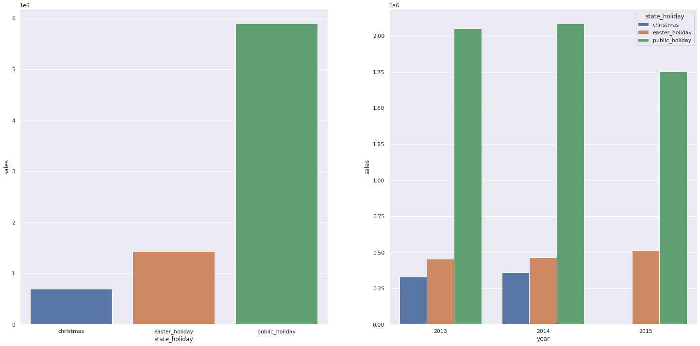
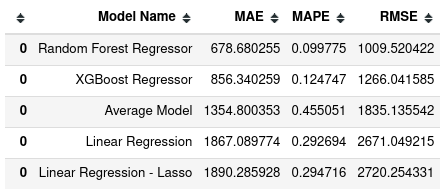
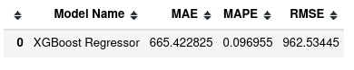
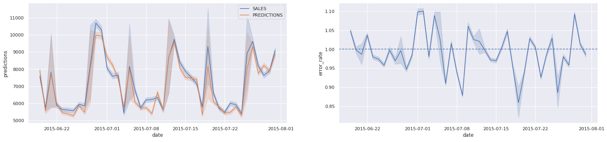
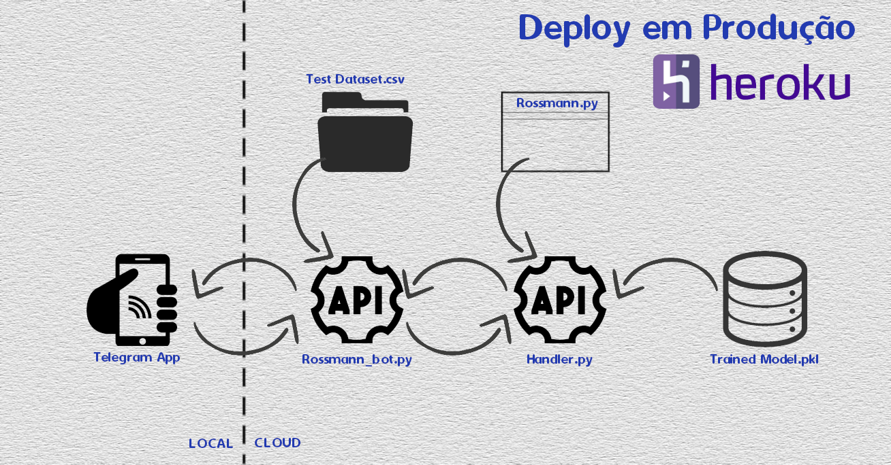
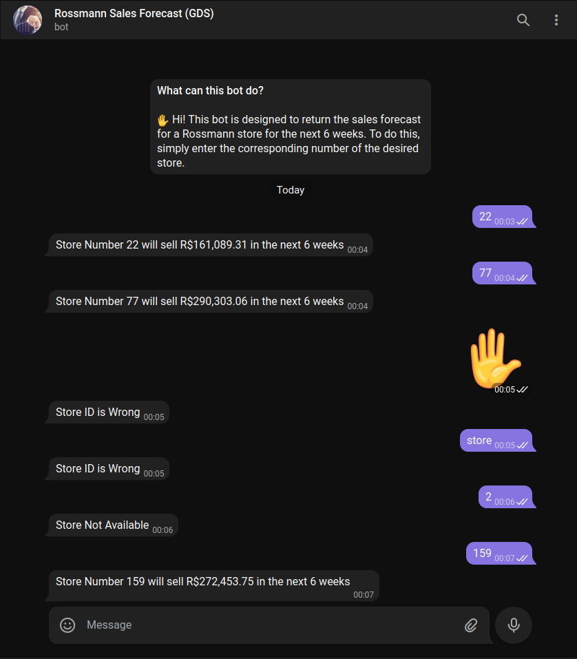

# **ENTENDIMENTO DO NEGÓCIO**

## **QUAL É A EMPRESA?**

A `Rossmann` é uma das maiores redes de drogarias da Europa, com cerca de 56.200 funcionários e mais de 4.000 lojas. Em 2019, a Rossmann teve um faturamento de mais de € 10 bilhões na Alemanha, Polônia, Hungria, República Tcheca, Turquia, Albânia, Kosovo e Espanha.

## **QUAL É O MODELO DE NEGÓCIO?**

A Rossmann é uma das maiores redes de drogarias da Europa, operando mais de 4.000 drogarias em 8 países. Sua gama de produtos inclui até 21.700 itens e pode variar dependendo do tamanho da loja e da localização. Além de produtos de drogaria com foco em pele, cabelo, corpo, bebê e saúde, a Rossmann também oferece itens promocionais ("Mundo das Ideias"), pet food, serviço de fotos e uma ampla variedade de alimentos e vinhos naturais. Existe também uma gama de perfumes com cerca de 200 marcas comerciais.

## **QUAL É O PROBLEMA DE NEGÓCIO?**

Os gerentes de loja da `Rossmann` precisam de previsões diárias de vendas com até seis semanas de antecedência para planejar os investimentos em infraestrutura em suas lojas (as vendas nas próximas seis semanas serão altas o suficiente para equilibrar o investimento em infraestrutura?). De posse dessa informação os gerentes poderão estimar o orçamento correto para fazer as devidas reformas em cada loja.

**Referências:**  
https://en.wikipedia.org/wiki/Rossmann_(company)

# **ENTENDIMENTO DO PROBLEMA**

## **QUAL O DESAFIO QUE ESTE PROJETO VISA SUPERAR?**

* Produzir um modelo que seja capaz de prever o faturamento das próximas seis semanas para cada loja da rede.

## **BUSINESS ASSUMPTIONS**
```
- Serão considerados apenas os dias em que as lojas estiveram abertas.
- Serão consideradas apenas as lojas que realizaram alguma venda ('sales' diferentes de zero).
- As informações de dia, mês, ano e semana do ano serão derivadas da feature 'date'.
- Lojas cuja feature 'Competition Distance' não tem informação, será considerado o valor 200000.
- Lojas cujas features 'promo since', 'promo_time_week' e 'CompetitionOpenSince' não tem informação,
  será considerada a informação de 'date' como parâmetro inicial.
```
### **O dataset possui as seguintes features**

|Feature                         | Definição                                                         |
|--------------------------------| ----------------------------------------------------------------- |
|Assortment                      | descreve o tipo de assortment: a = basic, b = extra, c = extended |
|CompetitionDistance             | distância em metros até a loja do competidor mais próximo |
|CompetitionOpenSince[month/year]| ano/mês aproximados de quando o competidor mais próximo abriu |
|Customers                       | o número de clientes em um dado dia |
|Date                            | data em que começou a coleta de informações da loja |
|Id                              | representa uma identificação (Store, Date) dupla dentro do conjunto de teste |
|Is_promo                        | indica se a loja está em promoção naquele mês |
|Open                            | indica se a loja estava aberta ou fechada: 0 = closed, 1 = open |
|Promo                           | indica se a loja está em promoção naquele dia |
|Promo2                          | indica se uma promoção foi extendida: 0 = loja não participa, 1 = loja participa |
|Promo2Since[year/week]          | descreve o ano/semana em que a loja aderiu à promoção extendida Promo2 |
|PromoInterval                   | descreve o intervalo de meses consecutivos em que a Promo2 começou |
|Sales                           | o montante de vendas em um dado dia |
|SchoolHoliday                   | indica se a loja (Store, Date) foi afetada pelo fechamento das escolas públicas |
|StateHoliday                    | indica um dia feriado. a = public holiday, b = Easter holiday, c = Christmas, 0 = None|
|Store                           | um Id único para cada loja |
|StoreType                       | representa 4 diferentes modelos de loja: a, b, c, d| <br>

**Referências:**  
https://www.kaggle.com/c/rossmann-store-sales


# **CICLO DO PROJETO**


## `Step 00. Settings and Data Extraction`
* Importação das bibliotecas, pacotes e funções necessárias.
* Carregamento e verificação dos dados disponíveis através de um arquivo CSV.

## `Step 01. Data Description`
* Renomeação das colunas e verificação do tamanho do dataset (avaliar a necessidade de ferramentas para tratar grande volume de dados).
* Verificação dos tipos de dados em cada coluna e mudanças de tipo que se façam necessárias para melhor tratamento pelos algoritmos posteriormente.
* Verificação de dados faltantes e decisão de como tratá-los (remoção, reamostragem artificial, inviabilidade da solução).
* Breve descrição estatística dos atributos numéricos e categóricos a fim de detectar anomalias que fogem do escopo do problema, bem como a presença de possíveis outliers que irão impactar a performance dos algoritmos posteriormente.

## `Step 02. Feature Engineering`
* Levantamento de uma lista de hipóteses de negócio.
* Criação de variáveis (features) relevantes para a resolução do problema.

## `Step 03. Data Filtering`
* Filtragem de linhas e deleção de colunas que não contém informações relevantes para a modelagem ou não ajudam a resolver o problema.

## `Step 04. Exploratory Data Analysis`
* Análise isolada de cada feature e sua relação com as demais.
* Exploração dos dados a fim de validar hipóteses de negócio e obter insights a respeito do negócio.

## `Step 05. Data Preparation`
* Preparação dos dados a fim de ajudar os modelos de machine-learning a aprenderem e performarem com maior facilidade. Aqui são feitas Normalização, Reescala e Transformação dos dados.

## `Step 06. Feature Selection`
* Separação dos dados em treino e validação.
* Seleção das features mais relevantes para treinar os modelos. Aqui se usam algoritmos de seleção de features como o Boruta.

## `Step 07. Machine Learning Modelling`
* Teste de diferentes modelos de Machine Learning.
* Seleção do modelo que apresenta melhor performance com base em métricas apropriadas que mitigam os erros.

## `Step 08. Hyperparameter Fine Tuning`
* Escolha dos melhores valores para cada parâmetro do modelo escolhido que maximizam a sua performance.

## `Step 09. Performance Evaluation and Interpretation`
* Comparação entre as previsões dadas pelo modelo e os dados de validação (avaliação da sua capacidade de aprendizado) a fim de detectar desvios de comportamento (overfitting e underfitting)
* Teste do Modelo treinado com dados equivalentes aos dados de produção (avaliação da sua capacidade de generalização) e conversão da performance do modelo em resultados de negócios (financeiros)

## `Step 10. Deployment`
* Criação da API (Application Programming Interface) para disponibilizar previsões em solicitações de internet. A API ficará hospedada num servidor na nuvem.(Heroku)
* Em seguida, para o usuário final, criar um bot do Telegram onde o usuário digita o número da loja e o bot responde com a previsão de vendas dessa determinada loja nas próximas seis semanas.

# **TOP 3 INSIGHTS**

### H2. Lojas com competidores mais próximos deveriam vender menos.

> `Falsa`: Lojas com COMPETIDORES MAIS PRÓXIMOS vendem MAIS.



**`INSIGHT`**: a existência de competidores próximos parece estimular o consumo, talvez pelo fato de que os clientes prefiram comprar em regiões onde há mais opções de lojas e a oferta de produtos é maior.

### H6. Lojas com mais promoções consecutivas deveriam vender mais.

> `Falsa`: Lojas com MAIS PROMOÇÕES CONSECUTIVAS vendem MENOS.



**`INSIGHT`**: o prolongamento de promoções parece causar um efeito negativo na percepção de valor dos produtos pelos clientes.  

### H7. Lojas abertas durante o feriado de Natal deveriam vender mais do que nos demais feriados.

> `Falsa`:  Lojas abertas NO FERIADO DE NATAL vendem MENOS do que nos demais feriados.



**`INSIGHT`**: o tipo de assortment das lojas parece não influenciar o consumo dos clientes durante o feriado natalino.

## **MACHINE LEARNING RESULTS**

> Após o treinamento de alguns modelos de ML, foi feita uma avaliação comparativa entre os modelos com base nas métricas de estimativas de erros escolhidas para este problema de regressão. As métricas foram o `MAE` (Mean Absolute Error), o `MAPE` (Mean Absolute Percentage Error) e o `RMSE` (Root Mean Square Error).

| Model Name                 |  MAE        | MAPE     | RMSE        |
| -------------------------: | ----------: | -------- | ---------:  |
|  Random Forest Regressor   | 678.680255  | 0.099775 | 1009.520422 |
|  XGBoost Regressor         | 856.340259  | 0.124747 | 1266.041585 |
|  Average Model             | 1354.800353 | 0.455051 | 1835.135542 |
|  Linear Regression         | 1867.089774 | 0.292694 | 2671.049215 |
|  Linear Regression - Lasso | 1890.285928 | 0.294716 | 2720.254331 |


<!---->

> Decidindo pelo uso do modelo de `XGBoost`, devido sua performance ser razoavelmente semelhante ao modelo mais acurado, mas cujo tamanho que ocupa em armazenamento ser significativamente menor, foi feito um processo de refinamento dos seus parâmetros (`Fine Tuning`) a fim de melhorar um pouco mais a sua performance (diminuir os erros de suas previsões)

| Model Name         |  MAE       | MAPE     | RMSE      |
| ------------------ | ---------- | -------- | --------- |
|  XGBoost Regressor | 665.422825 | 0.096955 | 962.53445 |

<!---->

> Pode-se avaliar também a capacidade de aprendizado do modelo ao se aplicá-lo aos dados de validação, acompanhando o quão próximo ele acerta as previsões de lojas que já sabemos o montante faturado mas o modelo ainda não viu os dados. Este processo visa detectar e corrigir possíveis problemas com `overfitting`. Os gráficos abaixo demonstram que o modelo possui um erro percentual médio (MAPE) em torno de 10%, quando ele erra para mais ou para menos do valor real das vendas ao longo das últimas 6 semanas.




## **BUSINESS RESULTS**

> Os resultados obtidos pelas previsões do modelo escolhido `XGBoost` levam em conta o melhor e o pior cenários, calculados pela variação do erro MAE (Mean Absolute Error). A Tabela a seguir mostra os valores somados de faturamento de todas as lojas previstos para as pŕoximas 6 semanas, considerando o `pior cenário` (quando o modelo superestima o valor das vendas) e o `melhor cenário` (quando o modelo subestima o valor das vendas)

| Cenários   |  Valores  |
| ---------  | --------- |
|  Predições |  $ 283.951.842,24 |
|  Pior      |  $ 283.203.495,28 |
|  Melhor    |  $ 284.700.189,21 |


## **BUSINESS SOLUTION**

**A seguinte imgagem explica a arquitetura de deploy utilizada na solução deste problema**



### **Telegram Bot**

> Para tornar as previsões mais simples para o usuário final, foi criado um bot do `Telegram` para que o usuário só precise digitar o número da loja e o bot responderá rapidamente a previsão de vendas dessa determinada loja nas próximas seis semanas.  
 Clique no ícone abaixo para acessar o aplicativo que retornará a previsão de vendas <br>

[](http://t.me/rossmann_gds_bot)



# **CONCLUSÕES**

Comparando a performance do modelo treinado com uma solução que, embora trivial como o Average Model - um modelo que prevê exatamente o valor médio que uma determinada variável pode assumir -, ainda é muito praticada por várias empresas que não tomam decisões de negócio baseadas em dados, podemos enxergar o grande poder de `alavancar resultados financeiros` que um projeto de `Data Science` pode oferecer às empresas.

Além disso, a `velocidade no processo de análise` e `segurança` que um modelo pode garantir na `tomada de decisão` por parte de um gestor são significativamente relevantes e não podem ser desconsideradas num cenário econômico cada vez mais competitivo e influenciado pelas novas tecnologias de geração e processamento de dados.


# **LIÇÕES APRENDIDAS**

* **Como construir uma API usando Flask e um bot no Telegram, hospedando ambos no Heroku, a fim de que o usuário possa acessar resultados de previsões de forma simples e rápida via aplicativo de mensagens**

* **Como desenvolver soluções intermediárias e de melhorias graduais ao longo do projeto, entregando valor mais rapidamente ao time de negócios até apresentar a solução final robusta e melhor acabada.**

* **Focar na resolução de problemas de negócios de forma mais essencial do que no uso de ferramentas**

* **Compreender a importância decisiva do desenvolvimento cíclico de projetos e perceber que a melhoria tanto de performance dos modelos quanto de resultados obtidos no negócio é gradualmente obtida à medida que mais ciclos são implementados**


# **PRÓXIMOS PASSOS**

**Streamlit**: criar um app web onde o usuário possa visualizar as previsões de vendas em gráficos mais intuitivos

**Telegram Bot**: aperfeiçoar o bot para exibir as previsões de vendas em forma gráfica e também exibir o total acumulado de mais de uma loja

**Features**: melhorar o desempenho dos modelos com a criação de novas features e combinações delas que sejam mais relevantes para os algoritmos e também façam sentido para o negócio.

**Code**: revisar e reescrever o código a fim de melhorar a clareza na leitura, como também diminuir o consumo de recursos computacionais.


# **LICENSE**

## All Rights Reserved - Comunidade DS 2021
